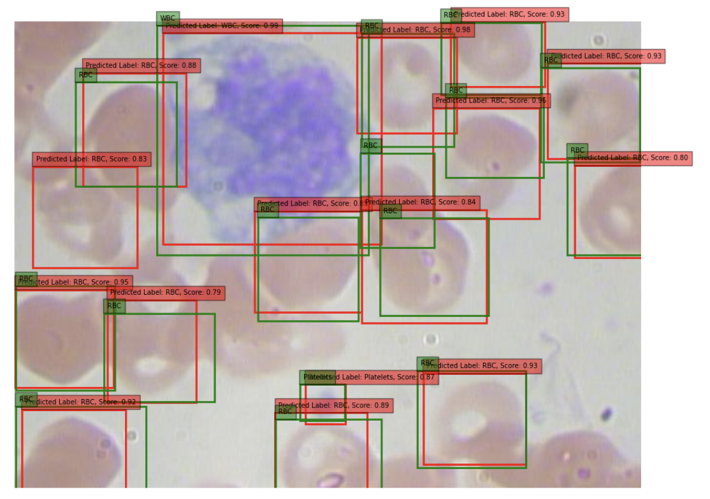

## [Project 1: DashMed Package Overview](https://github.com/mattangoh/DashMed)
* A PyPi package made for medical professionals to use in medical office settings
* Combines SQLite databases with simple dashboard tools
* Users can quickly import patient data from .csv files into a database and view on user-friendly dashboards
* Includes feature to create and view blood pressure data trends on a line chart
* Inludes user control features to see who can update, insert, or change patient data records

*Figure 1: A blood pressure chart presenting the diastolic, systolic pressure and the heart rate of a patient over the course of a year.*

*Figure 2: A dashboard presenting the information of a patient.*

## [Project 2: R-CNN Model Classification of Blood Cells](https://github.com/shaytran/bloodcell_fasterRcnn.git)

* Implements Faster R-CNN with ResNet50 for precise blood cell classification using the BCCD dataset.
* Overcomes traditional image processing limits using a region proposal network for enhanced detection accuracy.
* Applies a detailed approach, including data preprocessing and the construction of a custom dataset class in Python for handling image and annotation data, ensuring compatibility with the deep learning model.
* Conducts comprehensive model training, optimization, and validation using metrics such as loss, precision, recall, F1-score, and mean Average Precision (mAP) to assess and enhance model performance effectively.
* Achieves an mAP of 87.4%, indicating potential for clinical application and areas for future improvement.

*Figure 1: Average precision on each blood type with different optimizers*

*Figure 2: Sample prediction@0.75 from the trained faster R-CNN model*

## [Project 3: FOOTBALL-API Wrapper](https://github.com/shaytran/footwrap.git)

* An API wrapper R package called `footwrap` that handles data from the API-FOOTBALL from RAPID_API
* Comprised of functiosn that wrangle and visualize data on numerous football statistics, including teams, players, and country
* Parsing through data and creation of clean, ready-to-work-with data frames
* Employs `ggplot2` and `gt` libraries to create visualizations and aesthetic displays of data and insights

*Figure 1: Example use of the `GetBiggestVenues` function.*

## [Project 4: Spatial Point Analysis on Bald Eagle Occurrences in British Columbia](https://github.com/shaytran/spatialanalysis_eagles.git)

* A spatial statistical analysis that aims to identify patterns and trends in bald eagle distributions across British Columbia using R, using a dataset of over 450,000 observations.
* Incorporates environmental covariates like Distance to Water, Human Footprint Index, Forest Coverage, and Elevation to explore how these factors influence eagle distributions and to develop predictive models.
* Employs statistical techniques like intensity calculations, quadrat testing, kernel density estimation, hotspot analysis, and Ripley’s K-function to examine spatial uniformity and clustering of eagle occurrences.
* Utilizes a Poisson point process model with covariates to initially guess and then refine with complex models involving splines for a better fit, illustrating the relationships between eagles and their environment.
* Uncovered insights that may assist in improving conservation strategies and land-use planning, showing the importance of complex models in ecological studies.

*Figure 1: Covariates classes & eagle occurrences plots.*

*Figure 2: Covariate plots with rho.*
